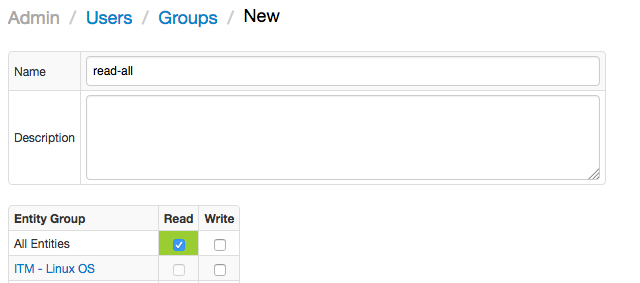
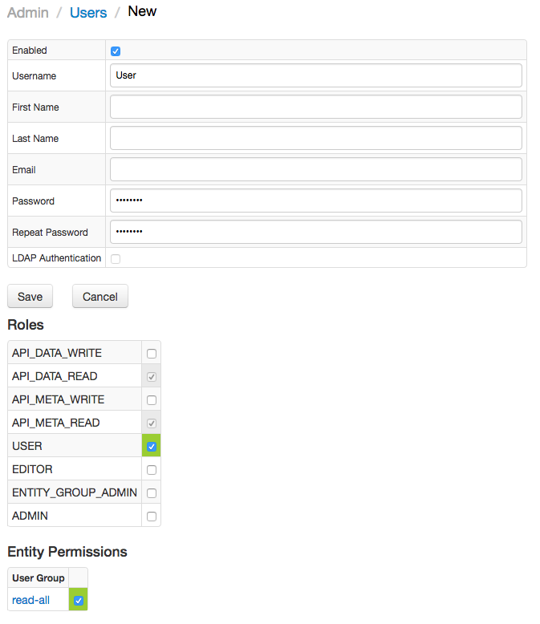
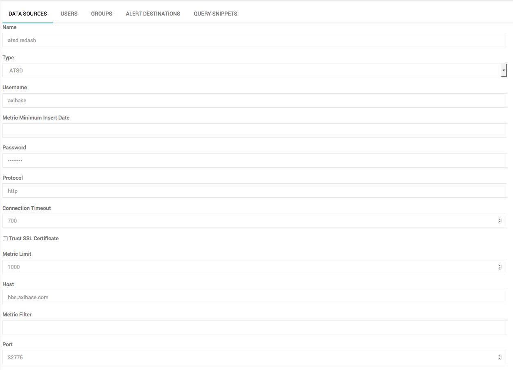
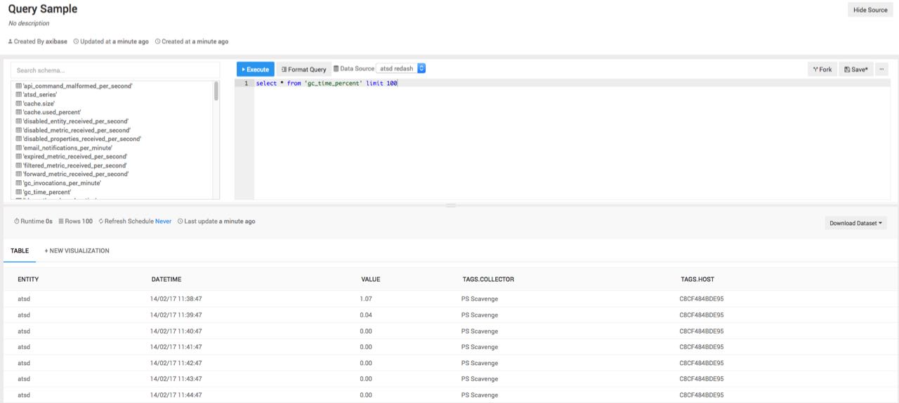

# ATSD

## ATSD User Setup

First you need to create an ATSD user that will have permissions to run queries with ATSD that stores your data.

### Create ATSD User Group to Allow Access to Your Data

1. Sign in to the ATSD at https://atsd_host:8443.
2. In the navigation pane, choose **Admin**, and then **User groups**.
3. On the bottom of pages press **Create**
4. Specify name and description.
5. Set 'All entities' to read.  
6. Press `Save` button.

### Create ATSD User 

1. Sign in to the ATSD at https://atsd_host:8443.
2. In the navigation pane, choose **Admin**, and then **Users**.
3. On the bottom of pages press **Create**
4. Specify username, password and other fields
5.  Set entity permissions for created `User Group`

## Create ATSD Data Source

In Redash, in the New Data Source page select "ATSD" as type and then fill out the details using the information from the previous step:

| **Name** | **Default Value** | **Required** | **Description** |
|:---|:---|:---|:---|
| `Username` | --- | Yes | User name |
| `Password` | --- | Yes |User password |
| `Metric Limit` | 1000 | No | Maximum number of tables. For more information click [here](https://github.com/axibase/atsd-docs/blob/master/api/meta/metric/list.md#query-parameters).|
| `Metric Filter` | --- | No | Include tables that match an expression filter. For more information click [here](https://github.com/axibase/atsd-docs/blob/master/api/meta/metric/list.md#query-parameters). |
| `Metric Minimum Insert Date` | --- | No | Include tables with `lastInsertDate` equal to or greater than minInsertDate. For more information click [here](https://github.com/axibase/atsd-docs/blob/master/api/meta/metric/list.md#query-parameters). |
| `Protocol` | http | Yes | Connection protocol |
| `Trust SSL Certificate ` | False | No |  Verify ssl certificate |
| `Host` | localhost | No | ATSD host|
| `Port` | 8088 | No | ATSD http(s) port|
| `Connection Timeout` | 700 | No | Request timeout in seconds |

## Run a Query

Everything setup, you can now query your data with **ATSD**.

